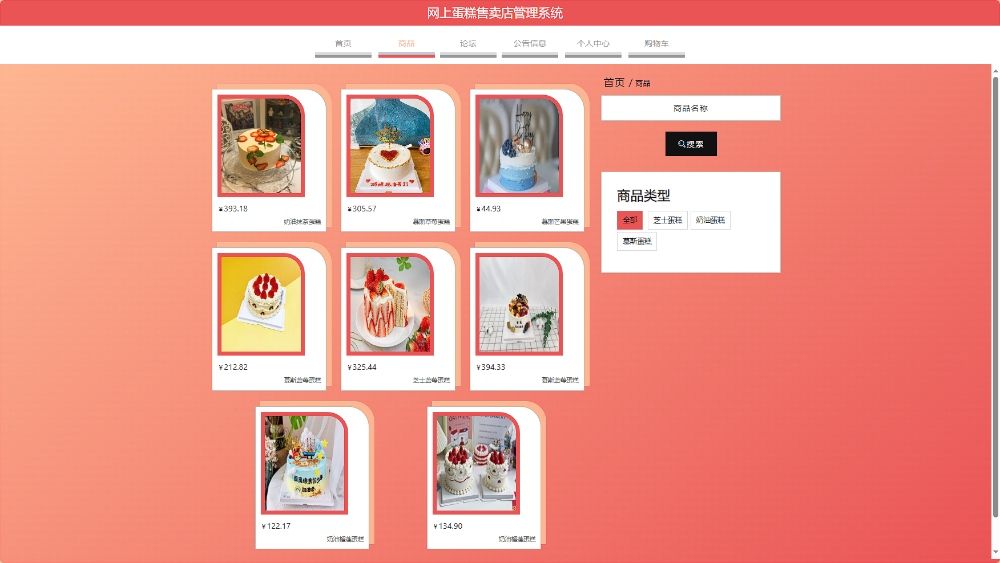
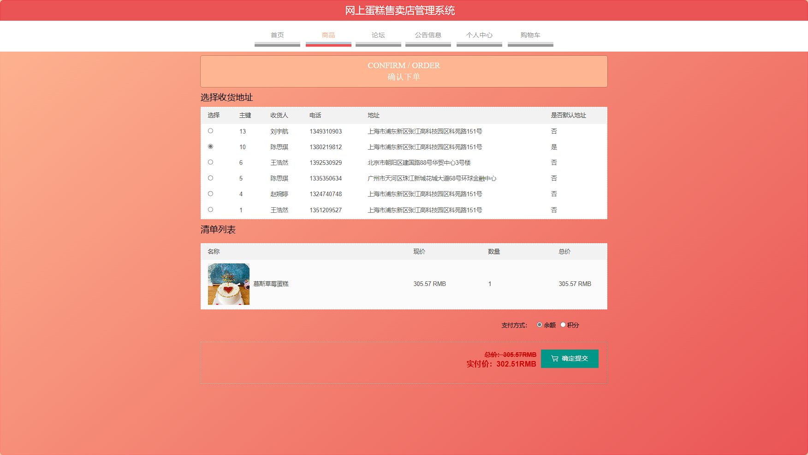
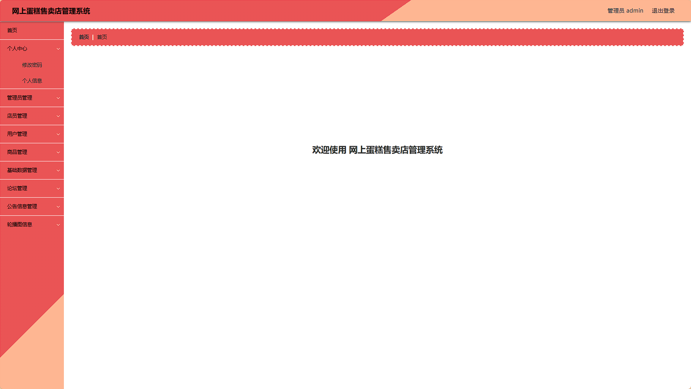

# 基于SpringBoot-Vue的网上蛋糕售卖店管理系统 / SpringBoot-based_Online_Cake_Store_Management


> 更多毕设项目可跳转至项目导航栏检索：[毕设项目](http://sysadmin.3vfree.vip)，需要联系博主v：xq-lucky311，q：1047944234. 备注：项目咨询
注：由于前端项目太大，仅上传了后端代码，未包含前端代码...

## 项目简介  
基于SpringBoot + MyBatis Plus + Vue.js的B/S架构电商管理系统，实现蛋糕商品展示、在线购物车、订单管理、用户权限控制等核心功能。系统采用前后端分离设计，后端提供RESTful API接口，前端使用ElementUI组件库构建用户界面。

## 特征介绍  
- **多层架构设计**：清晰划分Controller、Service、DAO、Entity层级，符合MVC设计规范。  
- **高效数据操作**：集成MyBatis Plus实现零SQL单表操作，支持自动分页与逻辑删除。  
- **安全认证机制**：通过自定义注解(@LoginUser)和拦截器实现接口权限控制。  
- **文件管理**：独立文件上传控制器与工具类，支持静态资源分类存储。  
- **多视图模型**：实体层包含VO、Model、View多维度数据封装，适应不同业务场景。  
- **线程池管理**：内置线程任务处理模块，优化高并发场景性能。  
- **配置中心化**：集中管理应用配置参数，支持动态加载系统字典数据。

## 代码结构 
```
src/
├── main/
│   ├── java/
│   │   ├── com/
│   │   │   ├── annotation/          # 权限注解(如@LoginUser)
│   │   │   ├── config/              # 全局配置(MybatisPlus/拦截器)
│   │   │   ├── controller/          # REST接口层
│   │   │   │   ├── AddressController.java
│   │   │   │   ├── CartController.java
│   │   │   ├── dao/                 # 数据访问层
│   │   │   ├── entity/              # 数据实体
│   │   │   │   ├── model/           # 业务模型
│   │   │   │   ├── view/            # 视图模型
│   │   │   │   ├── vo/              # 值对象
│   │   │   ├── interceptor/         # 请求拦截器
│   │   │   ├── service/             # 服务层
│   │   │   │   ├── impl/            # 服务实现
│   │   │   ├── utils/               # 工具类(日期/文件操作)
│   │   │   ├── wangshangdangaodianApplication.java # 启动类
│   ├── resources/
│   │   ├── mapper/                  # MyBatis映射文件
│   │   ├── application.yml          # 主配置文件
│   │   ├── static/                  # 静态资源
│   │   │   ├── upload/              # 图片上传目录
```
## 使用说明
**访问地址**  
前台登录页面：http://localhost:8080/wangshangdangaodian/front/index.html  
后台登录页面：http://localhost:8080/wangshangdangaodian/admin/dist/index.html  

**测试账户**  
- 管理员：admin/admin  
- 店员：a1/123456 | a2/123456 | a3/123456  
- 用户：a1/123456 | a2/123456 | a3/123456  

**数据库配置**  
编辑`src/main/resources/application.yml`：  
```yaml
url: jdbc:mysql://127.0.0.1:3306/wangshangdangaodian?useUnicode=true&characterEncoding=utf-8
username: root
password: 123456
```

# 项目实际截图：
## 登录：


## 前台：







## 后台：



> 等等...

# 精选项目导航 & 快速部署工具
## 项目资源一站直达
- ​**访问项目导航站**：[点击进入](http://sysadmin.3vfree.vip)**快速检索所需项目名称**
- ​**技术栈全覆盖**：Java/SSm/Spring Boot/小程序等主流技术方案
- ​**配套资源**：每个项目均提供部署文档 + 演示视频（附效果截图）

### ▌导航站预览


### ▌工具界面预览


## 捐赠
> 博主将持续更新Java全栈开发项目，包含ssm，springboot，前后端分离系统等项目。
> 此外如果您够宽裕，请博主喝杯咖啡吧！捐赠将用于服务器维护与开源社区建设，感谢您的认可！
> 如需更多Java相关项目毕设3000+，有其他项目需求，sql文件等可联系博主v:xq-lucky311

---